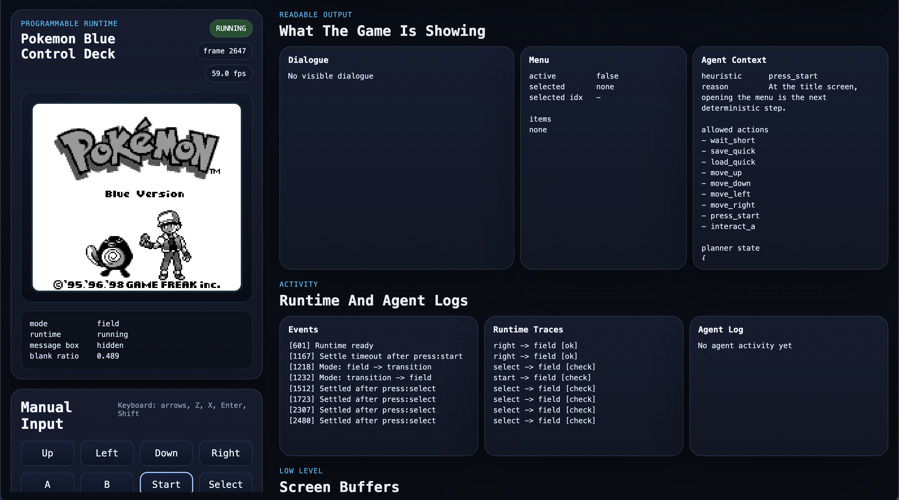

# Pokémon Red And Blue Disassembly + Programmable Runtime



This repository is the `pret/pokered` disassembly of Pokémon Red and Blue, and
this fork also contains a local programmable runtime for launching, observing,
controlling, and instrumenting the game from code.

It currently supports two main workflows:

- build the original ROMs from source
- run the local runtime/telemetry stack and drive the game through a web UI and
  Codex agent loop

## What This Fork Adds

Fork-specific additions live primarily in `tools/runtime/` plus a few top-level
launcher scripts:

- `play`
  Manual macOS launcher for opening a built ROM in SameBoy
- `runtime`
  Local launcher for the PyBoy-backed runtime server and web UI
- `agent-runner`
  External controller that can drive the runtime with heuristic mode or Codex
  app-server mode
- `TELEMETRY_RUNTIME_PLAN.md`
  Working execution plan and progress tracker for the runtime/telemetry effort

## ROM Outputs

This repo still builds the original ROM targets:

- Pokemon Red (UE) [S][!].gb `sha1: ea9bcae617fdf159b045185467ae58b2e4a48b9a`
- Pokemon Blue (UE) [S][!].gb `sha1: d7037c83e1ae5b39bde3c30787637ba1d4c48ce2`
- BLUEMONS.GB (debug build) `sha1: 5b1456177671b79b263c614ea0e7cc9ac542e9c4`
- dmgapae0.e69.patch `sha1: 0fb5f743696adfe1dbb2e062111f08f9bc5a293a`
- dmgapee0.e68.patch `sha1: ed4be94dc29c64271942c87f2157bca9ca1019c7`

## Setup

For standard disassembly setup and RGBDS requirements, start with
[**INSTALL.md**](INSTALL.md).

For the runtime environment, use the runtime-specific instructions in
[**tools/runtime/README.md**](tools/runtime/README.md).

## Build

Build the default ROMs with:

```bash
make -j4
```

Build a specific target with:

```bash
make blue
make red
make blue_debug
```

## Manual Play

To build and open a local playable ROM on macOS:

```bash
./play
./play red
./play blue-debug
```

See [**PLAYING.md**](PLAYING.md) for the manual flow.

## Programmable Runtime

To launch the runtime server and web UI:

```bash
./runtime --paused
./runtime --auto-run
```

Then open:

```text
http://127.0.0.1:8765/
```

The runtime currently provides:

- framebuffer capture
- symbol-aware telemetry
- validated button input
- save/load runtime states
- recent action traces
- a built-in Codex-driven agent controller

Internally, the runtime now boots through
[`tools/runtime/runtime_app.py`](tools/runtime/runtime_app.py) and is split into
specialized modules for emulator lifecycle, snapshot assembly, trace recording,
input execution, and planner/objective flow rather than a single session file.

See [**tools/runtime/README.md**](tools/runtime/README.md) for endpoints,
runtime commands, and the agent-control flow.

## Current Execution Plan

The current runtime project is tracked in
[**TELEMETRY_RUNTIME_PLAN.md**](TELEMETRY_RUNTIME_PLAN.md).

At the moment:

- foundational runtime work is in place
- telemetry, dialogue/menu decoding, and Codex app-server control are working
- the next main workstream is map-aware overworld navigation and richer
  telemetry for intentional movement

## See Also

- [**Wiki**][wiki] (includes [tutorials][tutorials])
- [**Symbols**][symbols]
- [**Tools**][tools]

You can find us on [Discord (pret, #pokered)](https://discord.gg/d5dubZ3).

For other pret projects, see [pret.github.io](https://pret.github.io/).

[wiki]: https://github.com/pret/pokered/wiki
[tutorials]: https://github.com/pret/pokered/wiki/Tutorials
[symbols]: https://github.com/pret/pokered/tree/symbols
[tools]: https://github.com/pret/gb-asm-tools
